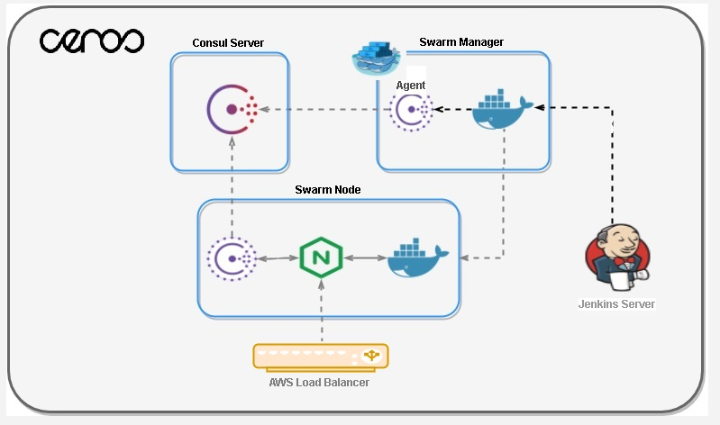

# Ceros
### Continuous delivery environment with highly availability Demo for Ceros.

#### Architecture Overview





###Tools

- **Ansible:** is a tool for automating infratructure and apps managament and it is used to bootstrap the infrastructure

- **Docker Swarm:** Docker Engine 1.12 includes swarm mode for natively managing a cluster of Docker Engines called a swarm. Use the  Docker CLI to create a swarm, deploy application services to a swarm, and manage swarm behavior.

- **Consul Server:** Consul has multiple components, but as a whole, it is a tool for discovering and configuring services in your infrastructure. It provides several key features of which the infrastrucre takes advantage: Service Discovery and Helth Checks.

- **Consul Template:** The daemon consul-template queries a Consul instance and updates NGINX templates on the file system so whenever a new microservice is deployed and registered via gliderlabs/registrator, consul template will automatically add it to the NGINX load balance configuration.

- **Registrator:** gliderlabs/registrator watches for new Docker containers and inspects them to determine what services they provide. For our purposes, a service is anything listening on a port. Any services Registrator finds on a container, they will be added to a service registry, in this case Consul.

- **NGINX:** Load balance proxy used to serve requests to microservices deployed among the swarm cluster.

##Ansible Playbook

### - bootstrap-cluster.yml

This playbook is used to create/change the Demo infrastructure with basic services.

The hosts file has three hosts sections detailed bellow:

```
[consul_server]
Used to specify the IP addresses of machines to install consul servers used for service discovery and templating NGINX load balancing.
[swarm_manager]
Used to specify the IP addresses of the machines to install swarm managers in the swarm cluster.
[swarm_node]
Used to specify the IP addresses of the machines to install swarm workers of the sweram cluster.
[jenkins]
Used to specify the IP address of the machine to install Jenkins.
```

###Running the playbook:

####Examples:

The bellow commnad will run the entire playbook in every node specified in the hosts file.
```shell-script
$ ansible-playbook bootstrap-cluster.yml
```
Additionally, this playbook has four Ansible group tags:

* **requirements**  - Use this tag when needed to install system requirements.
* **consul**        - Use this tag when needed to install Consul servers.
* **manager**       - Use this tag when needed to install Docker swarm managers.
* **node**          - Use this tag when needed to install Docker swarm workers.
* **jenkins**       - Use this tag when needed to install Jenkins.

Tags are used to group ansible tasks so one can run only some of the playbook's tasks needed for an installation and the tags
can be specified alone or mixed up.

####Examples:

##### The following command will run the tasks with the tag requirements:
```shell-script
$ ansible-playbook bootstrap-cluster.yml --tags "requirements"
```
##### The following command will run the tasks with the tag consul:
```shell-script
$ ansible-playbook bootstrap-cluster.yml --tags "consul"
```
##### The following command will run the tasks with the tag requirements, consul and jenkins:
```shell-script
$ ansible-playbook bootstrap-cluster.yml --tags "requirements,consul,jenkins"
```

####Roles:

Roles are specified in /playbooks/roles folder and they work like include files, in this case, included in bootstrap-cluste.yml
playbook providing reusable abstraction of tasks.

- **docker:**         Tasks used to install and configure Docker engines.
- **consul-server:**  Tasks used to install and configure consul servers.
- **consul-agent**    Tasks used to install and configure consul agent (client mode).
- **swarm-member:**   Tasks used to install and configure a swarm-member. Both manager and node are swarm-members, this role installs and configures their mutual requirements
- **swarm-manager:**  Tasks used to install and configure a swarm-manager.
- **swarm-node:**     Tasks used to install and configure a swarm-node.
- **jenkins:**        Tasks used to install and configure Jenkins.


This playbooks automatically deploys two services:
- **gliderlabs/registrator:**  Service that automatically registers and deregisters the microservices at Consul for any Docker container by inspecting containers as they come online/offline.
- **nginx-consul-template:**   Service used to proxy incoming traffic to the microservices registered in Consul by the registrator.

####Running services manually:

To deploy services in the swarm mode, follow the example bellow:
```shell-script
sudo docker service create --mode global --name nginx-consul-template --env CONSUL=172.17.0.1:8500 -p 80:80 tmaior/nginx-consul-template
```
* ** sudo docker service create   :** Tells docker to create a docker service;

* **--name nginx-consul-template  :** - Tells docker the name to use for this container;

* **--mode global                 :** - Tells docker to deploy this one instance of this service for each available worker node in the swarm cluster and this is the case for nginx-consul-template and gliderlabs/registrator services;

* **--env CONSUL=172.17.0.1:8500  :** - Tells docker to use the environment variable CONSUL passing its value to the container;

* **-p 80:80                      :** - Works just as regular docker run commands to publish the specified ports source:target;

* **tmaior/nginx-consul-template  :** - Image that will be deployed 

